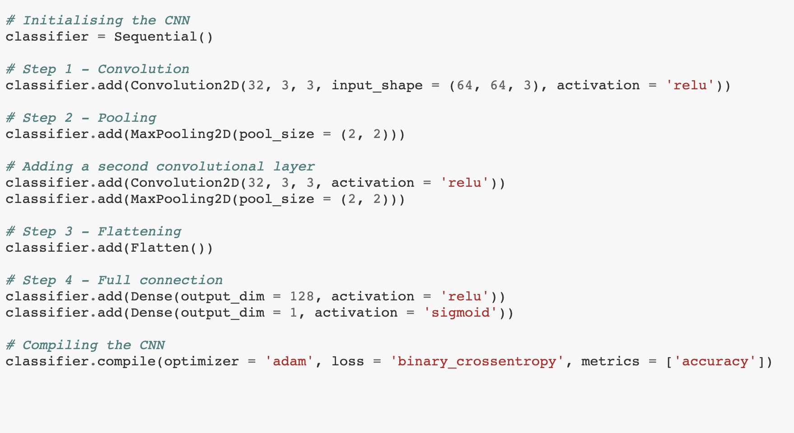

- About Dataset :
Food 101 is a labelled data set with 101 different food classes. Each food class contains 1000 images. Using the data provided, a deep learning model built on Keras/TensorFlow is trained to classify 2 classes in Food 101 dataset.

Classes: (sushi, frish and chips)

- Model :
To create a convolution neural network to classfied the images, Keras Sequencial model is used.

